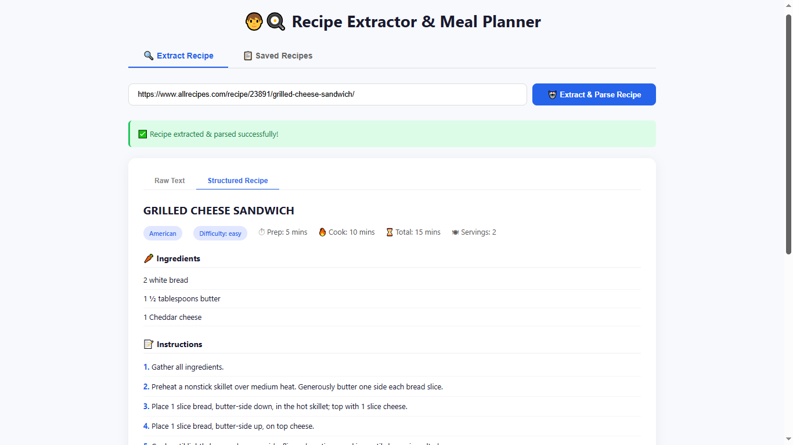
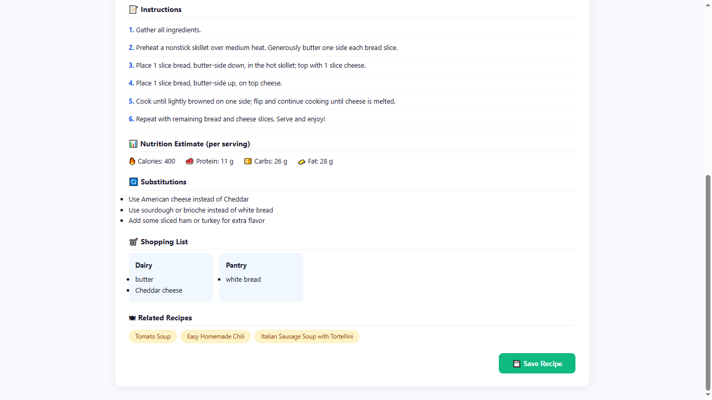
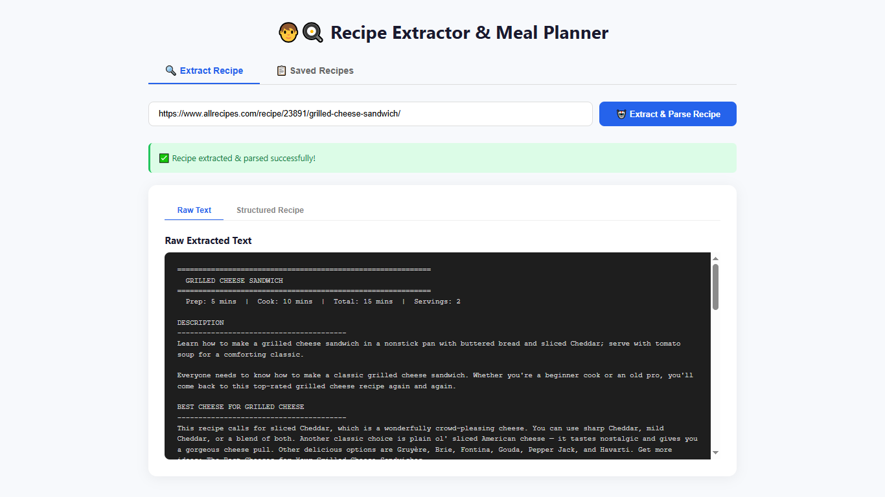
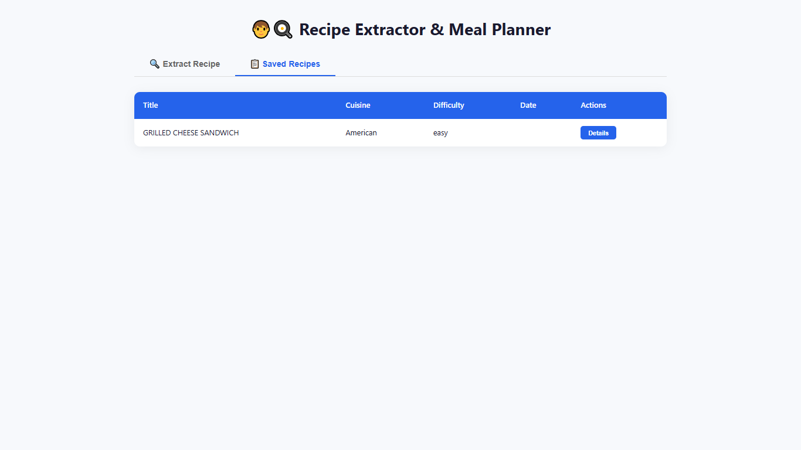
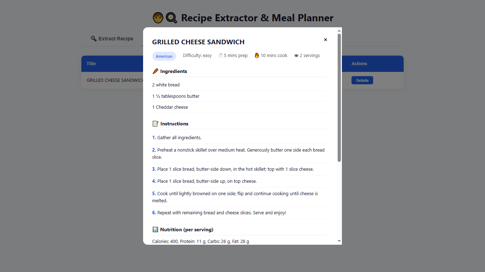

# Recipe Extractor & Meal Planner



A FastAPI-powered recipe extraction and meal planning demo that turns recipe web pages into structured JSON, then saves results to Supabase.

## Screenshots

### Tab 1: Recipe Extraction

| Recipe extraction (1) | Recipe extraction (2) |
| --- | --- |
|  |  |

### Tab 2: Recipe History

| Recipe history (1) | Recipe history (2) |
| --- | --- |
|  |  |


## What this project does

This app provides a two-tab frontend:

- **Recipe Extraction**: Paste a recipe blog URL, extract raw page text, and parse it into a structured recipe using an LLM.
- **Recipe History**: View saved recipes from Supabase in a table, and inspect details with a modal view.

The backend exposes a FastAPI API that:

1. scrapes raw recipe page text with `scraper.py`
2. parses recipe content using Groq via LangChain in `llm.py`
3. saves structured recipe JSON to Supabase in `db.py`

## Technical requirements

- Python 3.11+ (recommended)
- FastAPI
- Uvicorn
- python-dotenv
- LangChain + LangChain Groq integration
- Groq `llama-3.3-70b-versatile` model support
- BeautifulSoup4 for HTML parsing
- Camoufox / Playwright for browser-assisted scraping
- Supabase client for database storage
- psycopg2 / PostgreSQL for database initialization

### Core dependencies

- `fastapi==0.104.1`
- `uvicorn[standard]==0.24.0`
- `pydantic==2.5.0`
- `python-dotenv==1.0.0`
- `langchain==1.3.2`
- `langchain-core==1.4.0`
- `langchain-groq==1.1.2`
- `camoufox==0.4.11`
- `beautifulsoup4==4.12.2`
- `supabase==2.30.0`
- `psycopg2-binary==2.9.12`
- `playwright==1.60.0`
- `requests==2.31.0`
- `python-multipart==0.0.6`

> See `requirements.txt` for the complete dependency list.

## Setup

1. Copy the example environment file:

```bash
cp .env.example .env
```

2. Install dependencies:

```bash
make install
```

3. Start the development server:

```bash
make dev
```

4. Open the app:

- Frontend: `http://localhost:8000`
- API docs: `http://localhost:8000/docs`
- ReDoc: `http://localhost:8000/redoc`

### Environment variables

The app expects the following variables in `.env`:

- `ENVIRONMENT`
- `DEBUG`
- `APP_NAME`
- `API_TITLE`
- `API_VERSION`
- `GROQ_API_KEY`
- `HOST`
- `PORT`
- `SUPABASE_URL`
- `SUPABASE_SERVICE_KEY`
- `DATABASE_URL`
- `SUPABASE_KEY`

## How it works

### Recipe extraction flow

1. The frontend sends a POST request to `/extract-raw` with the target recipe URL.
2. `main.py` calls `scrape_recipe()` from `scraper.py` to read page HTML and extract visible recipe text.
3. The raw text is returned to the browser and sent to `/ai-parse`.
4. `/ai-parse` uses `llm.py` to call `parse_recipe_text()`.
5. `parse_recipe_text()` loads a Groq-compatible LLM using `ChatGroq`, then applies the prompt template from `prompts/prompt.py`.
6. The resulting structured recipe JSON is returned to the browser and may be saved to Supabase with `/save-recipe`.

### LangChain prompt usage

The core parser prompt lives in `prompts/prompt.py` as `RECIPE_PARSE_TEMPLATE`.
It instructs the model to:

- return a strict JSON object only
- preserve valid JSON formatting
- map ingredients to `{ "quantity": "", "unit": "", "item": "" }`
- return individual instruction steps
- include nutrition estimate, substitutions, shopping list, and related recipes

This prompt is combined with LangChain's `ChatPromptTemplate` and `ChatGroq` in `llm.py`.

## API endpoints

- `GET /` — serves `recipe_extractor.html`
- `POST /extract-raw` — extract raw recipe text from a URL
- `POST /ai-parse` — parse raw text into structured recipe JSON
- `POST /save-recipe` — save a parsed recipe to Supabase
- `GET /recipes` — list saved recipes
- `GET /recipes/{id}` — fetch one saved recipe by ID
- `GET /status` — health and endpoint summary

## Testing

Run the test suite with:

```bash
make test
```

Or directly:

```bash
pytest -v
```

> If no tests exist yet, this command will still prepare the environment for future test files.

## Development commands

```bash
make help
make install
make dev
make lint
make format
make clean
```

## Notes

- `.env` loading is handled through `python-dotenv` in `main.py`, `db.py`, and `llm.py`.
- Supabase is used to persist structured recipe JSON.
- The frontend includes two main tabs: `Extract Recipe` and `Saved Recipes`.
- Save recipe detail cards include ingredients, instructions, nutrition, substitutions, shopping lists, and related recipes.

Enjoy building with Recipe Extractor & Meal Planner! 👩‍🍳🍽️
